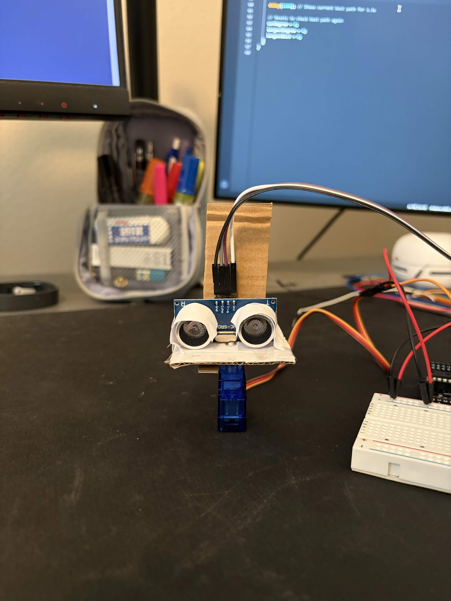

# arduino-scan-sensor
Arduino-based ultrasonic radar scanner that sweeps a servo to find the most open direction.

## What it does
- Scans its surroundings and identifies clearest open direction
- Continuously scans to account for a changing environment

## Hardware Used
- Arduino Uno
- HC-SR04 Ultrasonic Sensor
- SG90 Micro servo Motor
- Breadboard (for power rails)

## How it works
The micro servo sweeps the area in a 0-180 degree range in 10 degree increments, pausing briefly at each angle to allow
the Ultrasonic Sensor to take a distance reading. It then compares the current distance reading to the current largest 
distance reading to see which is the largest. After a full 180 degree sweep, the servo will go back to the direction it was
facing when it had the clearest path (largest distance), while also reporting the distance over Serial. Once a full 180 degree
sweep is complete, it will reset to scan again.


## Challenges / What I learned
**Securely mounting the Ultrasonic Sensor to the Micro servo Motor**

  I currently do not own or have access to a 3D printer, so I felt as though I could not properly mount them together.
Using what little tools I had, I was able to mount the sensor to the servo using cardboard, paper, screws, and tape to
create a decent solution. Currently however, I have to hold the servo in place manually with my fingers for it to operate.
Another thing to note is it also has a small amount of wiggle room, which could lead to less accurate results.



**Accounting for Physical Restraints**

  Previously, I was working only with the software so I did not account for the physical constraints. In one of the 1st
drafts of my program, I went straight from moving the servo to the current degree to measuring the distance between the
object and the sensor, without accounting for the time it takes for servo to move to the current degree in the physical
world. After some inconsistent results, I identified the problem to be with the absence of a delay. After the implementation
of the delay, I received more consistent results.

**Choppy Servo Movement**

  During my first iterations of the program, I realized the servo motor was very choppily sweeping the area. After going
  through my code multiple times, I was able to identify the problem with my if statement block.

  Initially it read:
  ```cpp
  void loop() {
  if(curDegree <= 180) {
    scan();
    curDegree+=10;
  }                          

  servo.write(largestDegree);  
  Serial.println(largestDist);
}
```

Making the servo go to the largest degree on every 10 degree increment. After inserting the outside code into an
if statement, I was greeted with smoother movement of the motor.

## Circuit / Wiring
- Servo signal: Pin 3
- HC-SR04 Trig: Pin 10
- HC-SR04 Echo: Pin 11
- Servo + sensor powered via breadboard rails

## Possible Next Steps
- 3D print a sturdier & snug casing/mount
- Mount atop a wheeled base for 'autonomous' navigation

